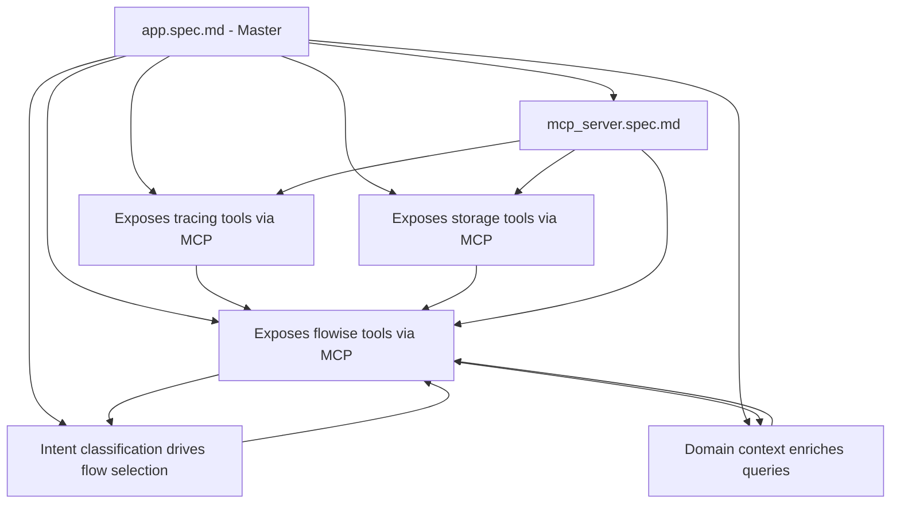

# Agentic Flywheel MCP - Orchestration Manifest

**Orchestration Session ID:** 5a90248b-cba1-4a79-9131-0c60ea23c441
**Langfuse Trace Session:** a50f3fc2-eb8c-434d-a37e-ef9615d9c07d
**Created:** 2025-11-18
**Status:** Active - Delegating component specifications

## Mission

Develop comprehensive RISE specifications for the Agentic Flywheel MCP enhancement with Langfuse tracing and Redis storage integration.

## Workspace Structure

```
_sessiondata/5a90248b-cba1-4a79-9131-0c60ea23c441/
├── ORCHESTRATION_MANIFEST.md (this file)
├── delegations/                # Task prompts for subagents
│   ├── task-01-flowise-integration.md
│   ├── task-02-langfuse-tracing.md
│   ├── task-03-redis-storage.md
│   ├── task-04-intent-classification.md
│   ├── task-05-domain-specialization.md
│   └── task-06-mcp-server.md
├── results/                    # Completed work from subagents
│   ├── flowise_integration.spec.md
│   ├── langfuse_tracing.spec.md
│   ├── redis_storage.spec.md
│   ├── intent_classification.spec.md
│   ├── domain_specialization.spec.md
│   └── mcp_server.spec.md
└── traces/                     # Langfuse trace references
    └── session_traces.json
```

## Delegation Strategy

### Parallel Workstreams

Each component specification can be developed independently by a subagent. The master specification (`rispecs/app.spec.md`) provides the context and integration points.

**Delegation Order:**
1. ✅ Task 01: Flowise Integration - READY FOR DELEGATION
2. ✅ Task 02: Langfuse Tracing - READY FOR DELEGATION
3. ✅ Task 03: Redis Storage - READY FOR DELEGATION
4. ✅ Task 04: Intent Classification - READY FOR DELEGATION
5. ✅ Task 05: Domain Specialization - READY FOR DELEGATION
6. ✅ Task 06: MCP Server - READY FOR DELEGATION

### Cherry-Pick Process

As each subagent completes their specification:

1. **Validate RISE Compliance**
   - Creative orientation language (not problem-focused)
   - Structural tension dynamics clear
   - Natural progression patterns
   - Autonomous implementation capability

2. **Check Integration Points**
   - References to other specs are conceptual (not file paths)
   - MCP tool signatures match coaiapy-mcp
   - Langfuse API usage follows patterns
   - Redis operations use standard coaiapy commands

3. **Cherry-Pick to rispecs/**
   ```bash
   cp results/[specification].spec.md ../../rispecs/
   git add rispecs/[specification].spec.md
   git commit -m "Add [component] specification from delegation task"
   ```

4. **Update Integration Map** (see below)

## Integration Map

Track how specifications connect to each other:



## Completion Criteria

### Per-Specification Checklist

Each completed specification must include:

- [ ] **Desired Outcome Definition** - What users create with this component
- [ ] **Structural Tension Analysis** - Current reality → Desired state
- [ ] **Creative Advancement Scenarios** - At least 2 detailed scenarios
- [ ] **Implementation Guidelines** - How LLM should implement
- [ ] **Integration Points** - How it connects to other specs
- [ ] **Quality Validation** - Success metrics and testing approach
- [ ] **RISE Compliance** - Creative orientation throughout

### Overall Project Completion

Project is complete when:

- [ ] All 6 component specifications written
- [ ] All specs validated for RISE compliance
- [ ] Integration points verified across all specs
- [ ] Master spec updated with final references
- [ ] All files committed to git branch
- [ ] PR created with comprehensive description

## Langfuse Tracing Strategy

**Main Trace:** `agentic-flywheel-mcp-orchestration`
- Session ID: `a50f3fc2-eb8c-434d-a37e-ef9615d9c07d`
- Trace observations for:
  - Each delegation task created
  - Each specification completed
  - Each validation performed
  - Each cherry-pick operation

**Subagent Traces:** Each delegation creates child observation
- Parent: Main orchestration trace
- Child: Individual specification development
- Metadata: Task number, specification name, completion status

## Success Metrics

**Delegation Efficiency:**
- Target: All 6 specs delegated within 1 session
- Parallel execution reduces total time 6x

**Specification Quality:**
- Each spec passes RISE compliance validation
- Integration points verified by cross-referencing
- Another LLM can implement from spec alone

**Cherry-Pick Success:**
- Zero merge conflicts
- All specs land in rispecs/ cleanly
- Git history shows clear progression

## Notes

- Subagents should reference master spec: `../../rispecs/app.spec.md`
- Subagents have access to: `__llms/llms-rise-framework.txt`
- Subagents can read: `src/agentic_flywheel/` codebase
- Results should be self-contained and autonomous

---

**Status Updates:**

| Timestamp | Event | Details |
|-----------|-------|---------|
| 2025-11-18 09:54 | Workspace created | Folder structure established |
| 2025-11-18 09:55 | Delegations prepared | 6 task prompts created |
| ... | ... | ... |

