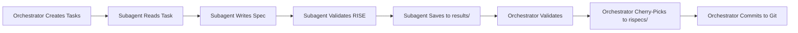

# Agentic Flywheel MCP - Subagent Delegation Workspace

**Orchestration Session:** 5a90248b-cba1-4a79-9131-0c60ea23c441
**Langfuse Trace:** a50f3fc2-eb8c-434d-a37e-ef9615d9c07d
**Created:** 2025-11-18

---

## 🎯 Quick Start for Subagents

If you're a subagent starting work on a delegation task:

1. **Read your task assignment:** `delegations/task-XX-[name].md`
2. **Study the master spec:** `../../rispecs/app.spec.md`
3. **Review RISE framework:** `../../__llms/llms-rise-framework.txt`
4. **Write your specification** following the task guidelines
5. **Save to results folder:** `results/[name].spec.md`
6. **Notify orchestrator** that your task is complete

---

## 📁 Workspace Structure

```
_sessiondata/5a90248b-cba1-4a79-9131-0c60ea23c441/
│
├── README.md                    # ← You are here
├── ORCHESTRATION_MANIFEST.md    # Overall mission and strategy
├── CHERRY_PICK_TRACKER.md       # Completion status tracking
│
├── delegations/                 # Task assignments for subagents
│   ├── task-01-flowise-integration.md
│   ├── task-02-langfuse-tracing.md
│   ├── task-03-redis-storage.md
│   ├── task-04-intent-classification.md
│   ├── task-05-domain-specialization.md
│   └── task-06-mcp-server.md
│
├── results/                     # Completed specifications (your output goes here)
│   ├── flowise_integration.spec.md      # Task 01 output
│   ├── langfuse_tracing.spec.md         # Task 02 output
│   ├── redis_storage.spec.md            # Task 03 output
│   ├── intent_classification.spec.md    # Task 04 output
│   ├── domain_specialization.spec.md    # Task 05 output
│   └── mcp_server.spec.md               # Task 06 output
│
└── traces/                      # Langfuse trace tracking
    └── session_traces.json
```

---

## 🚀 How to Launch a Subagent Session

### For the Orchestrator (Main Session)

To delegate a task to a new Claude session:

```bash
# Example for Task 01
claude "$(cat _sessiondata/5a90248b-cba1-4a79-9131-0c60ea23c441/delegations/task-01-flowise-integration.md)" \
  --session-id [new-session-id] \
  --add-dir /home/user/ava-Flowise
```

**Or create a simple launcher script:**

```bash
#!/bin/bash
# launch_subagent.sh <task-number>

TASK_NUM=$1
WORKSPACE_DIR="_sessiondata/5a90248b-cba1-4a79-9131-0c60ea23c441"

# Find task file
TASK_FILE=$(ls ${WORKSPACE_DIR}/delegations/task-${TASK_NUM}-*.md)

if [ -f "$TASK_FILE" ]; then
  echo "Launching subagent for: $TASK_FILE"
  cat "$TASK_FILE"
  echo ""
  echo "===== PASTE THE ABOVE INTO NEW CLAUDE SESSION ====="
else
  echo "Error: Task file not found for task ${TASK_NUM}"
fi
```

### For Subagents (New Sessions)

When you receive a delegation task:

**Step 1:** Confirm you understand the task
```
I've received delegation task-XX for [Component Name]. I will create a RISE-compliant specification following the guidelines provided.
```

**Step 2:** Read required context files
- `../../rispecs/app.spec.md` (master specification)
- `../../__llms/llms-rise-framework.txt` (framework guide)
- Relevant source code mentioned in task

**Step 3:** Draft specification
- Follow the format in your task assignment
- Use creative orientation language
- Include required scenarios
- Define success metrics

**Step 4:** Validate RISE compliance
- Focus on what users CREATE (not problems solved)
- Define structural tension clearly
- Describe natural progression
- Ensure autonomous implementation

**Step 5:** Save your work
```bash
# Save to results folder
cat > _sessiondata/5a90248b-cba1-4a79-9131-0c60ea23c441/results/[name].spec.md <<'EOF'
[Your specification content]
EOF
```

**Step 6:** Report completion
```
Task completed! Specification saved to results/[name].spec.md

Summary:
- [X] All required sections included
- [X] RISE compliance validated
- [X] [N] creative advancement scenarios
- [X] Success metrics defined
- [X] Integration points documented

Ready for cherry-picking to rispecs/ folder.
```

---

## 📋 Available Tasks

### Task 01: Flowise Integration ⚡ HIGH PRIORITY
**File:** `delegations/task-01-flowise-integration.md`
**Component:** Flowise Integration (flow management, querying)
**Effort:** 60-90 minutes
**Status:** 🟡 Available for delegation

### Task 02: Langfuse Tracing ⚡ HIGH PRIORITY
**File:** `delegations/task-02-langfuse-tracing.md`
**Component:** Langfuse Tracing (observability, creative archaeology)
**Effort:** 60-90 minutes
**Status:** 🟡 Available for delegation

### Task 03: Redis Storage 🔷 MEDIUM PRIORITY
**File:** `delegations/task-03-redis-storage.md`
**Component:** Redis Storage (caching, session continuity)
**Effort:** 45-60 minutes
**Status:** 🟡 Available for delegation

### Task 04: Intent Classification ⚡ HIGH PRIORITY
**File:** `delegations/task-04-intent-classification.md`
**Component:** Intent Classification (natural language routing)
**Effort:** 60-75 minutes
**Status:** 🟡 Available for delegation

### Task 05: Domain Specialization 🔷 MEDIUM PRIORITY
**File:** `delegations/task-05-domain-specialization.md`
**Component:** Domain Specialization (context-aware responses)
**Effort:** 50-65 minutes
**Status:** 🟡 Available for delegation

### Task 06: MCP Server ⚡ HIGH PRIORITY
**File:** `delegations/task-06-mcp-server.md`
**Component:** MCP Server (tool/resource definitions)
**Effort:** 70-90 minutes
**Status:** 🟡 Available for delegation

---

## ✅ Quality Standards

All specifications must meet:

### RISE Framework Compliance
- [ ] **Creative Orientation:** Focuses on what users create
- [ ] **Structural Tension:** Current reality → Desired state clearly defined
- [ ] **Natural Progression:** Advancing patterns, not forced steps
- [ ] **Autonomous Implementation:** Another LLM could implement alone

### Content Requirements
- [ ] All required sections included
- [ ] At least 3 creative advancement scenarios
- [ ] Success metrics quantified and measurable
- [ ] Integration points conceptually referenced (no file paths)
- [ ] Implementation guidelines clear and complete
- [ ] Error handling strategies defined

### Language Standards
- [ ] Uses "enables users to create..." (not "solves problem of...")
- [ ] Describes "natural progression" (not "must" or "forces")
- [ ] Emphasizes "structural dynamics" (not willpower)
- [ ] Frames features as "advancement enablers" (not problem fixes)

---

## 🔄 Workflow Overview



---

## 📊 Progress Tracking

**Track your progress:**
1. Check `CHERRY_PICK_TRACKER.md` for current status
2. Update when you complete a task
3. Notify orchestrator via completion message

**Orchestrator tracks:**
- Task delegation timestamps
- Subagent session IDs
- Completion dates
- Cherry-pick status
- Git commit references

---

## 🆘 Need Help?

### If you're stuck on RISE compliance:
- Re-read `../../__llms/llms-rise-framework.txt`
- Study examples in `../../rispecs/app.spec.md`
- Focus on desired outcomes, not current problems

### If you're unsure about integration points:
- Reference other components conceptually
- Avoid hardcoded file paths
- Describe what you need, not where it is

### If you're missing context:
- Read the existing source code mentioned in your task
- Study the master spec's scenarios
- Review similar specifications for patterns

---

## 🎯 Success Criteria

**Individual Task Success:**
- Specification passes RISE validation
- All required sections complete
- Success metrics defined
- Ready for autonomous implementation

**Overall Project Success:**
- All 6 specifications completed
- All cherry-picked to rispecs/
- All committed to git
- Master spec references validated
- Pull request created

---

**Ready to start? Pick a task from `delegations/` and begin!**
